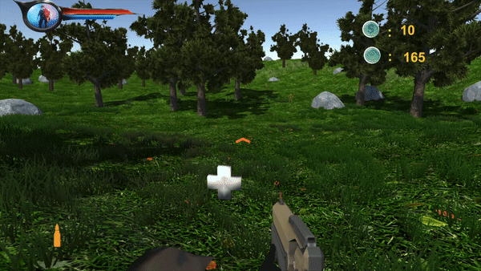

**The University of Melbourne**
# COMP30019 – Graphics and Interaction

Final Electronic Submission (project): **4pm, November 1**

Do not forget **One member** of your group must submit a text file to the LMS (Canvas) by the due date which includes the commit ID of your final submission.

You can add a link to your Gameplay Video here but you must have already submit it by **4pm, October 17**

Link to Gameplay video: https://youtu.be/isjt3VMnujc

# Project-2 README

You must modify this `README.md` that describes your application, specifically what it does, how to use it, and how you evaluated and improved it.

Remember that _"this document"_ should be `well written` and formatted **appropriately**. This is just an example of different formating tools available for you. For help with the format you can find a guide [here](https://docs.github.com/en/github/writing-on-github).

**Get ready to complete all the tasks:**

- [x] Read the handout for Project-2 carefully.

- [x] Brief explanation of the game.

- [x] How to use it (especially the user interface aspects).

- [x] How you designed objects and entities.

- [x] How you handled the graphics pipeline and camera motion.

- [x] The procedural generation technique and/or algorithm used, including a high level description of the implementation details.

- [x] Descriptions of how the custom shaders work (and which two should be marked).

- [x] A description of the particle system you wish to be marked and how to locate it in your Unity project.

- [x] Description of the querying and observational methods used, including a description of the participants (how many, demographics), description of the methodology (which techniques did you use, what did you have participants do, how did you record the data), and feedback gathered.

- [x] Document the changes made to your game based on the information collected during the evaluation.

- [x] References and external resources that you used.

- [x] A description of the contributions made by each member of the group.

## Table of contents
* [Team Members](#team-members)
* [Technologies](#technologies)
* [1 Game Description](#1-Game-Description)
* [2 Game Instruction](#2-Game-Instruction)
* [3 Objects and Entities Design](#3-Objects-and-Entities-Design)
* [4 Graphics Pipeline and Camera Motion](#4-Graphics-Pipeline-and-Camera-Motion)
* [5 Procedural Generation Techniques](#5-Procedural-Generation-Techniques)
* [6 Shader](#6-Shader)
* [7 Particle System](#7-Particle-System)
* [8 Evaluation](#8-Evaluation)

## Team Members

| Name | Task | State |
| :---         |     :---:      |          ---: |
| Yibo Peng  | Player movement function, attacked function, the UI of player, Procedural Generation Techniques - Bullet Generation, Camera Motion     |  Done |
| Zhiming Deng    | Enemy movement function, attack function, enemy patrol and chase, enemy health controller, enemy generation, usability and difficulty testing      |  Done |
| Xueqi Guan    | Health&Energy&Ammo Pickups shader, fog shader, game landscape, game instruction menu, cooperative evaluation, make group video      |  Done |
| Yuxiang Wu    | Enemy random generated, game menu UI, user menu, start, pause, exit game, different levels menu, apply questionnaire method |  Done |

## Technologies
Project is created with:
* Unity 2021.1.13f1

## 1 Game Description
Our game is named Forest Runner, which is a first-person shooter game with 3 different difficulty levels. The player needs to kill goblins to get Health, Energy, Ammo Pickups and reach the target score to win.

## 2 Game Instruction
2.1 Start & Exit Game
* The user opens the game landscape and can see the main menu with three buttons: Start , Help and the close button.
* Click the “Help” button to see the game instructions.
* The close button is on the top right side for the player to exit the game. 

2.2 Choose Level
* To start the game,  just click the “Start”.
* After clicking the “Start” button, the user can see the Level Choice menu and can choose “Easy”, “Normal” , “Difficult” level scenes. 
* After choosing a level, the user needs to click the main green button under the level instruction part to start the game. 

2.3 Play Game
* During the game, the user can press “ESC” to mute the background music or choose “Again” or “Quit” the game.
* For the key operation, WASD keys for player move, if pressing at the same time, the player will sprint. 
* Clicking the left mouse will start shooting. 
* Space key for Jump.
* C key for Crouch or Stand up.
* R key for Reload. 
* Killing the general monster, score increases 10, there is a chance to pick up Red or Blue pickups.
* Killing a special monster, score increases 30, there is a chance to pick up Green or Ammo pick up. 
* Red pick up can make the player's health increase 30%.
* Blue pick up can make the player's energy increase 50%.
* Green pick up can make the player's health and energy increase 50%.
* Ammo pick up can make the player's damage increase 25%.

 The user needs to reach the target score on the menu within the limited time to win the game.

## 3 Objects and Entities Design
### 3.1 Player
The player object is one of the most complicated objects in this game, it consists of several sub-objects, which are the player’s movement module, the player’s attack module, the player’s attribute module, and the player’s information display module. Next, I will introduce the design of these modules in detail.
 
#### - **The player’s movement module**
This part follows the current mainstream first-person shooter game’s character movement, and the purpose is to allow players who have played this type of game to get started with the game at the fastest speed without novice guidance. At the same time, the key setting of the game is very scientific, which is in line with the playing habits of mainstream players.
 
In our game, the player has three modes of movement, namely walking, sprinting, and crouching. The movement of the player is controlled by the mouse and the “W”, “A”, “S”, “D” key. The mouse controls the direction of the character's travel, and the corresponding keys control the character's front, back, left, and right movement. Additionally, pressing the “Space” key can make the player jump in our game.
 
The default movement method of the player is walking. Holding down the left shift can make the player sprint. The moving speed of the character increases, but it will consume a certain amount of endurance. When the endurance is 0 or the left shift is released, the character returns to the walking state. When the player presses the “C” key, the movement of the character will become crouching, and the movement speed of the character will slow down. After pressing the “C” key again, the movement of the character will change to the walking state. Flexible use of these three movement methods can give players an advantage when facing enemies.
 
Besides, in order to make the player’s gaming experience more realistic, these three modes have different footstep sound effects. Taking the walking state as a reference, when the player sprints, the footstep sound effects are rapid and louder. On the contrary, when the player is in a crouching state, the footstep sound effects are slow and the sound is smaller.
 
####  - **The player’s attack module**
Considering the production cost and material limitations of this game, players in this game only have a gun as a means of attack. The player uses the mouse to aim and click the left mouse button to shoot.
 
In order to make the player’s shooting experience more realistic, we have added the animation of the player changing the bomb, the animation of holding the gun when idle, the sound effect of shooting, and the spark of the muzzle.
 
In order to create an exciting game atmosphere, we reasonably set the player’s ammunition quantity and reload time. When the player’s remaining ammo quantity is 0 or after the player presses the “R” key, the player will have a period of time to reload and cannot attack.
 
#### - **The player’s attribute module**
In this game, the player has the following attributes, life value, endurance value, score, remaining time, remaining bullets.
 
When the player is attacked, the health value will be reduced. When it is reduced to 0, the game is over. The player can restore a certain amount of health by eating the blood bag.
 
When the player sprints, the endurance value will continue to decrease. When the endurance value is 0, the player cannot sprint. The endurance value will be automatically restored when the player is not sprinting. The endurance value can also be restored when the player eats the endurance pack.
 
Players will get corresponding bonus points after killing different monsters. After reaching a certain score, the player will win.
 
In order to increase the tension and rhythm of the game, the player has a time limit. When the time is over, the player does not reach the score target, and the player fails the game.
 
The player also has a bullet limit. When the number of bullets is 0, the player will be unable to attack for a period of time due to reloading, which can also enhance the excitement of the game.
 
#### - **The player’s information display module**
In order to improve the player’s gaming experience, the player’s health, endurance, score, remaining time and remaining bullets will be displayed on the screen with different UI. At the same time, the UI layout of this game refers to the UI layout of current mainstream games. The player's health and stamina values are displayed in the upper left corner of the screen; the score and remaining time are displayed in the upper right corner of the screen; the remaining bullets are displayed in the lower left corner of the screen. This design is in line with the play habits of most players.
In addition, in order to improve the player’s shooting experience and reduce the difficulty of the game, we provide a shooting sight so that the player will hit the target more easily.
 
### 3.2 Environment
The game environment is a forest which contains grass, trees and rocks. The game has two modes: normal mode and foggy mode. If foggy mode is selected, there will be fog in the forest.

### 3.3 Pickups
There are four different types of pickups: health pickup, energy pickup and ammo pickup. Each of them has different effects on the player.
* Red health pickup: Player’s health will be restored by 30%. If the player's health is already full, picking it up causes no effect.
* Blue energy pickup: Player’s energy will be restored by 50%. If the player's energy is already full, picking it up causes no effect.
* Green health and energy pickup: Both Player’s health and energy will be restored by 50%. If the player's health or energy is already full, picking it up causes no effect.
* Ammo pickup: Player’s attack damage will be increased by 5. The player can only get this pickup once in a game.

### 3.4 Enemies
An enemy object in this game will automatically attack the player if the player attacks or gets too close to it. Also, the player needs to kill enemies to get scores to win the game. Then, I will further introduce the enemy's movement, attack, being attacked and death in detail.

An enemy can run or walk when chasing the player. We decide that when the player get too close to an enemy it will chase the player by walking, while if the enemy is attacked by the player it will run to chase the player. And we use the navigation AI agent in Unity for the enemy to find a valid path to the player.
In the movement mechanism, There is one thing worth attention. If An enemy is walking to the player because it thinks the player is too close to it, it will stop if the player run far away. However, if the enemy is attacked and then runs to the player, the player could only kill the enemy or it will never give up.
Moreover, the enemy will frequently patrol in a small random range to add the chance of encountering the player.

The enemy’s attack mode is close combat. The enemy will use a broadsword to attack the player when getting close enough.  When being attacked, the player’s HP will decrease periodically according to the enemy’s attack frequency. Enemy cannot move and attack at the same time. It is worth saying that we also provide a sound effect of cutting for the enemy’s attack animation, and it is also very useful to remind the player of being attacked.

Like the player, an enemy contains a health controller. An enemy’s HP will decrease when the enemy is shooted by the player. And it will die when its HP decreases to 0. 
And also after an enemy dies, it will drop off a pickup.
Pickup of killing an ordinary enemy:
60% probability of a red pick up, 30% probability of a blue pickup, 10% probability of nothing
Pickup of killing a special enemy:
First time: 100% probability of a Ammo pickup
After the first time: 100% probability of green pickup
For the effect of the pickups, please see Section 3.3

We will have special enemies on the map. Different from the ordinary enemy, they are stronger with higher HP and attack damage. Correspondingly, rewards(score, pickup) of killing a special enemy is better than killing an ordinary enemy.

### 3.5 Menu 
Our start menu has three buttons “Start” and “Help”, and a close button on the right top side for existing. If the user clicks the “Help” button, an instruction interface pops out. If the user clicks the “Start” button, the game will enter into a new page for users to select different level modes, which have easy, normal and difficult levels and click the main green button under the level window to enter the game. Once entering the game, users can press the “ESC” to pop out the menu to adjust sound or mute, and users can choose Again to restart the game, choose Level to choose a different level scene,  and choose the Quit button, the game will go back to the main menu. Users can see the amount of bullets on the left bottom side and a timer and score on the right top side. Once the user loses the game, there will be a game over interface that pops out, vice versa, if the user wins, there will be a win interface. 

## 4 Graphics Pipeline and Camera Motion
### 4.1 Graphics Pipeline
The rendering pipeline, also known as the graphics pipeline, represents the process of getting a
virtual environment drawn onto the computer screen.

Simplified graphic pipeline: Vertices -> Vertex Shader -> Rasterizer -> Interpolator -> Fragment Shader (Texture) -> Screen
* Vertices: Vertices in mesh.
* Vertex Shader: Vertex shader takes vertices in mesh as input, and converts them from local space to clip space. Then output vertices in clip space.
* Rasterizer: This process is handled by unity.
* Interpolator: This process is handled by unity.
* Fragment Shader: Fragment shader takes the output from vertex shader as input, and outputs a color. Texture will be applied in fragment shader.
* Screen: Render pixels on the screen.

### 4.2 Camera Motion
Because our game is a first-person shooter game, in our design, the camera is equivalent to the player’s eyes. When the player moves, as a sub-part of the player, the movement of the camera is exactly the same as the movement of the player. The player can control the horizontal rotation of the camera with the mouse, which is used to simulate the effect of the player looking around in the game. This design can make the player more immersive when playing. 

Second, in order to make the characters in the game more in line with human behavior in reality, we have restricted the pitch angle of the camera. The pitch angle of the camera ranges from -45 degrees to +45 degrees.
 
## 5 Procedural Generation Techniques
### 5.1 Bullet
Because our game is a shooting game, in the game, the player will shoot a lot and quickly. For the generation and destruction of bullets, we adopt the design pattern of object pool and singleton. When the game scene is loaded (that is, the awake phase), the bullet pool is created, and the number of bullets is enough for the player to be created. The number of bullets in the bullet pool is set based on our repeated experiments and the maximum number of bullets that the player can fire at a time.
The advantage of using this design pattern is to reuse bullets in the pool, without the overhead of allocating memory and creating bullets in the heap, without the overhead of releasing memory and destroying bullets in the heap, thereby reducing the burden on the garbage collector and avoiding memory jitter; no need to repeat initialize object state. Using this design pattern can increase the number of running frames of our game and give players a better experience. Using the singleton mode can further increase the number of frames of the game, because there is only one instance of the bullet object pool in the memory, which reduces the memory overhead.
If the bullet is generated when the player shooting action occurs, it will undoubtedly consume a lot of computer resources and reduce the number of running frames of the game. 

### 5.2 Enemy
The system will generate enemies one by one and periodically as time passes. Then we will introduce this mechanism in details
Implementation details
We have two important parameters for the generation algorithm: max limit of the number of alive enemies and the frequency of generation. 
For instance, currently we set the max limit to 45 and frequency to 0.3. Then the system will generate an enemy at a random valid position on the map every 0.3 second and it will stop doing this until the number of alive enemies reaches 45. Note that dead enemies will not be counted, so this algorithm ensures that finally the number of alive enemies is 45. Moreover, for saving memory, a dead enemy object will be destroyed after the death animation finishes playing. 
For the random position of an enemy generation, we also set some restrictions on that. The position will not be very close to the player and any obstacle items which an enemy cannot get through.

There are some advantages of using this procedural generation mechanism. First, using periodical generation rather than a one-off generation at the beginning will let the program run smoothly. Second, using a max number limit could ensure a stable density of enemies. Third, generation at a random position is also helpful to ensure that enemies evenly split. In other words, if generated at random positions, enemies probably distribute evenly on the map instead of gathering in a small corner.

for details, see the codes in RandomGenerate.cs file
## 6 Shader
### 6.1 Pickup Shader

  

Path to the source file: Assets/Shaders/RedHealthPickup.shader

The shader has 3 properties:
* MovingDistance: The distance of up and down movement
* MovingSpeed: The speed of up and down movement
* FlashingSpeed: The speed of flashing (color changing)

Methods used in vertex and fragment shader:
* moveUpDown: It takes the vertex position, moving speed and moving distance as inputs, adds vertex position by displacement: (0, sin(_Time.y * speed) * distance, 0, 0), and finally returns the new vertex position. The sin(_Time.y * speed) provides a number between -1 and 1, which can ensure the object moves up and down in an oscillating fashion.
* flashing: It takes the speed as an input, and returns either red or white colour. The step(0, sin(_Time.y * speed)) returns either 0 or 1, and it is used to determine the G and B value. If the value is 1, the output color will be (1, 1, 1, 1), otherwise, the output color will be (1, 0, 0, 1).
* phongShading: It takes vertex position and color as inputs. Then it calculates ambient RGB intensities, diffuse RGB reflections, specular reflections and sum up all these values and return.  

Vertex shader does the following: 
* It updates the vertex position by applying moveUpDown method before transforming the vertex position to clip space.
* It converts vertex position and normal to world space by multiplying them by unity_ObjectToWorld.
* It converts vertex position in world space to clip space by using UnityObjectToClipPos method.
The output of the vertex shader will become the input of the fragment shader.

Fragment shader does the following:
* It uses the flashing method to get either red or white color. 
* It updates the color by applying phongShading method
* It returns a color

### 6.2 Fog Shader

  

Path to the source file: Assets/Shaders/SphericalFog.shader

The shader has 5 properties:
* FogCenter: The center of the fog. It is stored in a vector with 4 values. The first 3 values represent x, y and z coordinates. The last value represents the radius of the spherical fog. The center has the highest density.
* FogColor: The color of the fog. It is set to white by default.
* Density: The overall density of the fog.
* CenterValue: The density of the fog at the center.
* ChagingSpeed: As shown in the .gif image, the center of the spherical fog has lowest clarity and the edge of the spherical fog has highest clarity. ChagingSpeed is the speed of changing in clarity when player move from edge of the fog to center of the fog.

Others
* Tag { “Queue” = “Transparent” }: This forces the object to be drawn at last 
* Blend SrcAlpha OneMinusSrcAlpha: This allows us to have a transparent object.
* ZTest Always: Turning on ZTest allows us to put objects within the fog.

Methods:
* raySphereIntersect: It takes sphere center, sphere radius, camera position and view direction as inputs and returns the ray sphere intersection position. The camera position is ray origin, view direction is ray direction. The intersection point(s) is computed by applying the quadratic formula: t0 = (-b + sqrt(b^2 - 4ac)) / 2a, t1 = (-b - sqrt(b^2 - 4ac)) / 2a, and the smaller t value is used to calculate the intersection position. 

Vertex shader does the following: 
* It converts vertex position and normal to world space by multiplying them by unity_ObjectToWorld.
* It converts vertex position in world space to clip space by using UnityObjectToClipPos method.
* It calculates the view direction by subtracting vertex position in world space by _WorldSpaceCameraPos

Fragment shader does the following: 
* Use the raySphereIntersect method to get the intersection position.
* Use the intersection position to calculate the clarity at current camera position. Clarity means how clear the fog is, and if it is equals to 1, it means fully clear. As shown in the .gif image, the center of the spherical fog has lowest clarity and the edge of the spherical fog has highest clarity. The clarity is determined by how far the camera is inside the fog. Therefore, we used the intersection position to calculate the clarity. 
* Output fog color with the alpha value set to 1 - clarity.

## 7 Particle System

  

In our game, the spark effect of the muzzle uses a particle system. This part can be checked at Assets/Models/Muzzle Flash. In the game, when the player fires a gun, the effect is immediately generated at the muzzle, and the shape of the gun spark will be randomly selected from the preset four, then the particle system will be closed after 0.5 seconds, making the shooting effect more realistic.

## 8 Evaluation 
### 8.1 Observational Method: Cooperative Evaluation
Description of Participants
There are 5 people who participate in the evaluation. Three of them are university students aged 20-25. Two of them are game development company employees aged 20-25. 

Description of Methodology
Cooperative evaluation requires experimenters to let participants perform a task. While they play, the experimenters can interact with them, such as ask them questions or help them if they are stuck. A set of tasks are created to evaluate the game and they are listed as below:
* Choose a game level
* Start playing game
* Kill one enemy
* Restore your health
* Reload your gun
* Run
* Restore your energy
* Pause the game and continue playing
* Win the game

### 8.2  Querying Method: Questionnaire
There are 6 participants who answer our questionnaire. The result is summarised in the table below. 

| No. | Questions | Choices | Count |
|---|---|---|---|
| 1 | Your gender | Male | 5 |
|  |  | Female | 1 |
|  2 |  Your age | 12-18 | 0 |
|  |  | 19-24 | 3 |
|  |  | 25-29 | 3 |
|  |  | 30-40 | 0 |
|  |  | Over 40 | 0 |
|  3 |  Your job | Company Manager | 0 |
|  |  | Student | 3 |
|  |  | Company staff | 3 |
|  |  | Freelance individual | 0 |
|  |  | others | 0 |
| 4 | Have you ever played shooter games before you played "Forest Runner? | Yes | 4 |
|  |  | No | 2 |
| 5 | When was your first contact with shooter games?  | Before or after entering Middle school   | 4 |
|  |  | After entering High school   | 0 |
|  |  | After entering the university | 0 |
|  |  | After having a job | 2 |
| 6 | Do you like the Game UI and Manual? |  Yes | 4 |
|  |  |  No | 2 |
| 7 | Do you like the characters in the game? |  Yes | 0 |
|  |  |  No | 6 |
| 8 | Do you feel comfortable for the difficulties of different levels?  | The difficulties are fair | 2 |
|  |  | The difficulties are not fair | 4 |
| 9 | Do you feel comfortable with the Game Operation keys? | Yes | 5 |
|  |  | No | 1 |
| 10 | Do you like the game scene and environment design of the Forest Runner? | Yes | 5 |
|  |  | No | 1 |
| 11 | Is it easy for you to win the game? | Easy | 2 |
|  |  | A little challenging |  |
|  |  | difficult | 4 |
| 12 | Can you see the objects clearly in Forest Runner? | Yes | 5 |
|  |  | No | 1 |
| 13 | Are you comfortable with the movement speed of the player or monsters in Forest Runner? | Yes | 5 |
|  |  | No | 1 |
| 14 | Could you write your suggestions for Forest Runner?  | User 1: Could you please add a mouse dpi changing function in settings. User 3: 1. Aim arrow to crosshair 2. There is a problem with the frequency of monster refresh, and it wastes a lot of time to find monster 3. There is no need for cataract fog in difficult mode, you can increase the difficulty of the game by increasing the number and intensity of monsters, and reach 100 points in a limited time; You can also increase difficulty by reducing the number of bullets. Easy mode provides 100 bullets, normal mode 50 bullets, and Hard mode 30 bullets. You can also change the terrain to make it more difficult, etc., without the cataract fog. User 4: Increase shooting accuracy. User 5: Monster speed is too fast and the interval between shots is too long. |  |

### 8.3  Feedback from Participants Summary
Game playing
* Game audio is great, game environment looks good, game logic is easy to understand, game control is easy to understand and pickups look great.
* Under easy mode, it is still hard to survive if the player meets the stronger monster at the beginning. 
* Too few monsters. Sometimes, it is really hard to find monsters.

User interface 
* The game instruction is cumbersome. It is better to use pictures in game instruction rather than plain text. 
* The game instruction font size and font type is difficult to read.
When player has died or time has run out, display “Game Over” and menu at the center of the page

Improvement made based on participants feedback:

Game playing
* Under easy mode, we increased player damage to make it easier to win.
* We increased the number of monsters to make it easier for the player to find monsters.

User Interface
* We include pictures in instruction to make it easy to read and understand.
* We display “Game Over” at the center of the screen when the player has died or time has run out, and make the menu automatically pop up after 1 second. 

## 9 Reference
* Crosshair UI: https://assetstore.unity.com/packages/2d/gui/icons/crosshairs-plus-139902
* Player health & endurance UI: https://assetstore.unity.com/packages/2d/gui/icons/rpg-unitframes-1-powerful-metal-95252
* ICON UI: https://assetstore.unity.com/packages/2d/gui/icons/icons-ui-95116
* Enemy model(with animations): https://assetstore.unity.com/packages/3d/characters/humanoids/fantasy/fantasy-monsters-zolrik-zolrikmercenary-strategy-rpg-124327
* Game menu ui: https://y.qichejiashi.com/tupian/4777499.html
* Ray sphere intersect: https://www.scratchapixel.com/lessons/3d-basic-rendering/minimal-ray-tracer-rendering-simple-shapes/ray-sphere-intersection
* Fog shader: https://github.com/leon196/ThreeSeconds/blob/master/Assets/Shaders/Spherical%20Fog.shader
* Fog shader: https://forum.unity.com/threads/volume-fog-shader.76113/
* FPS weapon: https://assetstore.unity.com/packages/3d/characters/humanoids/sci-fi/easy-fps-73776
